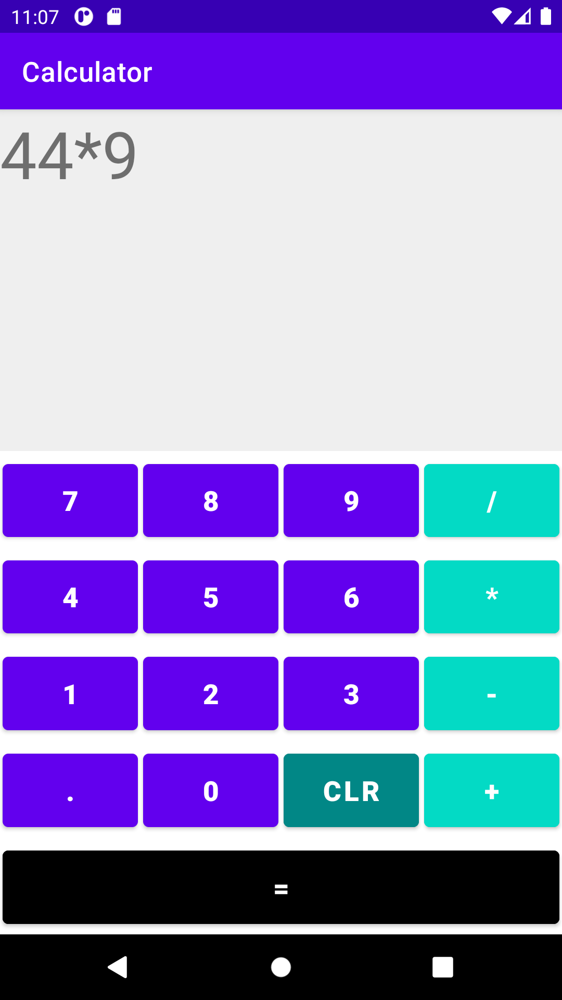

# calculator
A simple calculator app using kotlin

I created this app so I can learn kotlin (my second app).
- [X] I learn to better build UI especially using the LinearLayout
- [X] How to use order of operation
- [X] How To create functions and connect them to the UI(buttons, text, etc.)

## What I want to learn
1. How to connect an application with a database 
2. How to work with rest API
3. The proper ways of State Management 
4. How to run test
5. Kotlin best architecture